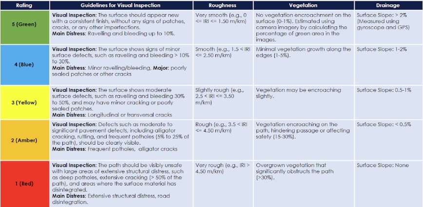

# PavAnalytics

Automating Pavement Condition Rating: A Deep Learning-Based Framework for Cycle Routes and Greenways.

## Overview

PavAnalytics is a deep learning framework designed to automatically assess pavement surface conditions from cycling infrastructure imagery.

The project includes:

- Fisheye Distortion Correction
- Pavement Condition Classification
- Explainable AI (Grad-CAM)
- Performance Evaluation

## Project Website
For additional project information, demonstrations, and results, visit:

Project Website: [https://www.paveanalytics.eu/]

## Publications

### Conference Papers

- M. H. Baig, J. A. Ayala Garcia, W. S. Qureshi, I. Ullah, Towards assessing cycleway pavement surface roughness using an action camera with imu and gps, in Proceedings of the 11th International Conference on Vehicle Technology and Intelligent Transport Systems - VEHITS, INSTICC, SciTePress, 2025, pp. 247–255. doi:10.5220/0013504900003941.

## Pavement Condition Rating Scale

We have introduced an intelligent pavement rating system for cycleways, named the Cycle Route Surface Index, a colour-coded, five-level rating system that combines visual inspection, roughness, vegetation, and drainage data to provide a clear and consistent pavement quality measure. 

## Project Structure

data/
fisheye_correction/
classification/
explainability/

## Status

Repository under development.
